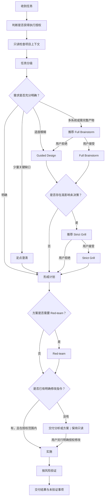

# Reliable Task Execution 使用说明

`reliable-task-execution` 用于提高复杂任务和变更任务的可靠性。它会根据任务风险选择最小充分流程，在必要时澄清需求、形成设计、挑战关键假设、确认执行授权，并在实施后验证结果。

默认只读，只有用户明确指示修改，才允许改代码或其他文件。自动加载或手动调用 Skill 都不等于授权修改。

它不会要求每个任务都经历完整仪式。需求已经明确、影响局部且风险较低时，Skill 应直接完成用户明确授权的工作；任务简单只能简化流程，不能跳过授权。

## 目录

- [一、快速开始](#一快速开始)
- [二、完整工作流程](#二完整工作流程)
- [三、任务分级](#三任务分级)
- [四、需求深化模式](#四需求深化模式)
- [五、方案审查与实施](#五方案审查与实施)
- [六、决策快照](#六决策快照)
- [七、常见用法](#七常见用法)
- [八、常见误用](#八常见误用)

## 一、快速开始

在提示词中明确调用 Skill，并说明你希望它完成什么。你不需要预先选择工作模式，Skill 会先采用最轻量的充分流程，并在确有必要时建议升级：

```text
Use $reliable-task-execution to implement this change and verify the result.
```

如果只有一个粗略想法，可以直接要求形成设计：

```text
Use $reliable-task-execution to brainstorm this feature idea and turn it into an actionable design.
```

如果已经有方案，可以让 Skill 自行判断是否需要严格质询：

```text
Use $reliable-task-execution to review this architecture proposal. Recommend Strict Grill if critical decision branches remain unresolved.
```

如果希望审查一份已经形成的计划：

```text
Use $reliable-task-execution to red-team this plan and recommend whether to execute, test first, revise, or restart.
```

## 二、完整工作流程



流程中的分支按需选择。Full Brainstorm 和 Strict Grill 都由 Skill 主动判断并推荐，但不会在未经同意时静默启动，也不会默认连续执行。

## 三、任务分级

| 类型 | 典型信号 | 默认处理 |
| --- | --- | --- |
| Quick | 目标明确、影响局部、风险低、结果稳定 | 默认只读回答；有明确修改指令才执行并验证 |
| Moderate | 包含若干步骤，或存在有限不确定性 | 给出简短计划；解决关键缺口且有明确修改指令后实施 |
| Deep | 跨模块、成本高、影响广或包含重要决策 | 先明确范围、风险、取舍和验收标准 |
| Experimental | 无法只靠推理确定结果 | 设计最小实验并定义成功标准 |

先判断授权，再进行任务分级。分级只决定流程深度，不产生修改权限，也不代表必须向用户展示复杂标签。一行改动、明显的 Bug、可回退的小修复同样需要明确修改指令。

## 四、需求深化模式

### 1. 定点澄清

适用于整体明确、但有一至三个关键缺口的任务。

- 先从项目中查找可以安全发现的答案。
- 每次只问会改变范围、行为、架构、风险或验收标准的问题。
- 必要时给出推荐默认项及其主要影响。
- 缺口解决后立即继续，不重复确认已经明确的内容。

### 2. Guided Design

这是默认的轻量设计深化模式，适用于目标粗略、边界部分未定或存在两三条合理路线，但不需要正式设计产物包的任务。

Guided Design 会逐步完成：

1. 明确目标、受影响用户或调用方、现状与约束。
2. 每轮聚焦一个重要决策主题。
3. 在确有替代方案时比较两至三个方案。
4. 明确给出推荐方案和决定性取舍。
5. 补齐相关边界、流程、失败行为、排除范围与验收标准。
6. 汇总设计和剩余假设。

### 3. Full Brainstorm

当任务涉及多个相互影响的子系统、需要架构与数据模型协同设计、需要正式团队交接，或多个设计领域同时存在重大未知项时，Skill 会说明原因、额外产物和对话成本，并询问是否升级。

判断公式：

```text
推荐 Full Brainstorm = 任一强触发条件，或至少两个辅助条件
```

强触发条件包括：

- 涉及三个或更多职责、数据或接口边界不同且相互影响的子系统；同一页面中的普通组件不分别计数。
- 从零设计边界未确定的产品、平台或大型业务域。
- 必须同时设计架构、数据模型和用户流程。
- 需要正式设计规格供团队评审或跨角色交接。
- 明确需要架构图、ER 图、状态图、交互流程等多种设计产物。
- 必须先拆分成多个可独立交付的项目或阶段。

辅助条件包括：

- 产品、交互、架构、数据、接口、安全、运维、测试和发布中至少三个领域存在重大未知项。
- 两条或更多可行路线会产生显著不同的架构、数据或用户体验。
- 权限、状态流转、失败恢复或数据一致性跨越模块边界。
- 需要先解决多个重要决策才能写出具体验收标准。
- 涉及迁移、分阶段发布、向后兼容或新旧路径共存。
- 多类用户或调用方具有明显不同的目标。
- 一个局部决策影响三个或更多下游模块或消费者。

用户接受后，Full Brainstorm 会：

1. 检查现有项目、文档和既有模式。
2. 先判断范围是否需要拆成多个独立设计单元。
3. 每轮只问一个问题，系统明确目标、用户、约束和成功标准。
4. 比较两至三个方案并给出推荐。
5. 分段呈现设计，每段确认后继续。
6. 按相关性覆盖架构、组件、用户与数据流、状态、数据模型、接口、失败处理、安全、性能、运维、测试、迁移和回滚。
7. 只生成有决策价值的产物；适合时使用 Mermaid 流程图、架构图、状态图或实体关系图。
8. 确实需要 Mockup 或并排视觉比较且环境具备视觉能力时，即时询问是否启用；不具备时使用 Mermaid 或静态说明并明确限制。
9. 对完整设计执行占位符、矛盾、歧义、失败场景和范围检查。

Full Brainstorm 默认仍是只读讨论。写入设计文档、创建提交或进入实施，需要分别获得授权。

### 4. Strict Grill

当已有方案包含高成本、难回退或高风险决策，并且仍有关键分支没有关闭时，Skill 会建议进入 Strict Grill。

判断公式：

```text
推荐 Strict Grill = 已有具体方案 + 至少一个高影响信号 + 至少一个未关闭关键分支
```

“具体方案”必须说明准备采用的路线，而不只是目标，例如拆分单体、共享数据库、改变认证模型或迁移框架。

高影响信号包括：

- 决策成本高或难以回退。
- 改变公共 API、共享 Schema、协议、公共组件或安全边界。
- 涉及生产数据迁移、删除或格式转换。
- 涉及认证、授权、隐私、支付或其他敏感行为。
- 影响多个系统、团队或现有消费者。
- 失败可能造成明显停机、错误数据或严重用户影响。
- 形成显著供应商锁定或长期基础设施成本。
- 需要大范围迁移、双写、分阶段发布或旧版本兼容。
- 依赖尚未验证的性能、容量、可用性或可靠性假设。

如果一个问题的不同答案会实质改变范围、架构、数据一致性、公共接口、安全、失败行为、迁移、成本、实施顺序或验收标准，并且没有明确处置，它就是未关闭关键分支。

只有以下状态算明确处置：已确认、明确接受假设及风险、明确延期并记录影响、因证据不足而阻塞且已有验证路径，或明确排除在范围之外。“以后再看”“应该没问题”等模糊表述不算关闭。

用户接受后，Strict Grill 会：

1. 将方案拆成结构化决策树。
2. 把节点标记为：未决、已确认、接受假设、明确延期或证据阻塞。
3. 每轮只追问一个最高优先级的未决节点。
4. 说明该问题影响的具体结果和取舍，但不替用户默默决定。
5. 沿回答暴露的新关键分支继续追问。
6. 每三至五个问题展示一次决策树进度，但不将阶段总结当作结束。
7. 在关键节点全部关闭、接受、延期，或用户明确停止之前，不输出最终方案。
8. 最终输出关闭后的决策树、决策快照、最终设计、接受的假设、延期事项和验收标准。

### 5. 渐进式升级规则

- 用户不需要记住或选择模式名称。
- Skill 默认从定点澄清或 Guided Design 开始。
- 每次只推荐一个下一模式，并说明原因、产物和交互成本。
- Full Brainstorm 和 Strict Grill 必须由用户确认后进入。
- 用户拒绝后继续轻量流程，记录接受的限制或风险，不反复劝说。
- Full Brainstorm 完成后，只有仍存在重大未决策时才推荐 Strict Grill。
- 用户明确说“保持简短”“完整头脑风暴”或“严格质询”时，直接尊重该选择。

所有设计模式的确认只代表方案对齐，不自动授权修改文件、代码或外部系统。

## 五、方案审查与实施

### Red-team

Red-team 面向已经形成的方案。它重点检查：

- 最可能导致方案失败的原因；
- 未验证的假设和遗漏的失败情况；
- 过于乐观的捷径；
- 是否存在更简单的路线；
- 可以最小成本证伪风险的实验。

最终建议应是：直接执行、先实验、修改方案或重新设计之一。

### 执行授权

默认只读。写入前必须能从对话中找到用户明确要求执行的动作、目标和范围；不能根据“用户应该想修好”“这个很简单”或某个关键词推断授权。判断的是整句话的含义和上下文，不是有没有出现“修改”“修复”。

| 用户表达或上下文 | 是否允许修改代码 | 预期行为 |
| --- | --- | --- |
| “帮我看看这个报错”“这个 Bug 太烦了” | 否 | 定位原因，给出结论和建议 |
| “这个怎么修复？”“是否应该修改这里？” | 否 | 解释可行性、改法或取舍 |
| “审查一下，有问题就列出来” | 否 | 报告问题，即使只需改一行也不动代码 |
| “分析一下怎么优化”“给我一个实现方案” | 否 | 在对话中提供分析或方案 |
| 只调用 `$reliable-task-execution` | 否 | 根据已有任务分析；任务不明确时澄清 |
| 讨论方案后说“方案不错”“可以”，或分析过程中说“继续” | 否 | 继续原有分析或设计范围 |
| “请修改这个校验规则”“修复这个报错” | 是 | 在明确范围内修改并验证 |
| “能帮我把这个超时改为 30 秒吗？” | 是 | 这是具体修改请求，可以执行 |
| “按刚才的方案开始实现” | 是 | 执行刚才明确的实施范围 |
| 对“是否将这个超时改为 30 秒？”明确回复“可以” | 是 | 执行这项具体修改 |
| “把方案写入 docs/plan.md” | 仅该文档 | 写入指定文档，不自动实施应用代码 |
| “测试这个流程并报告问题” | 否 | 在测试授权范围内验证，不顺手修复或更新快照 |

没有修改授权时，可以安全读取上下文，也可以在对话中展示建议代码或补丁，但不得应用补丁、创建计划文件、顺手清理代码，或通过格式化、lint 自动修复、代码生成、快照更新和脚本改写文件。

只读问题交付分析结果即可完成，不必每次都追问是否实施。如果后续确实需要实施，先说明具体修改，再询问一次并等待明确答复；沉默不算授权。用户无需额外写“不要改代码”才能保持只读。

同一未完成任务中已有明确修改授权时，不要逐次编辑重复确认；应完成范围内的修改和验证。已完成任务或其他任务的授权不覆盖新问题。用户明确要求“先别改，只分析”后，应停止后续写入。扩大实施范围，以及部署、发布、推送、破坏性操作、敏感信息访问和外部系统写入，仍需要针对具体动作单独确认。

### 验证

实施后从最小相关检查开始，再根据风险扩大范围，例如：

- 格式、静态分析和类型检查；
- 聚焦测试与更广泛回归测试；
- 构建检查；
- 行为或界面变化后的真实用户路径验证；
- 最终差异、意外文件和敏感信息检查。

Skill 不应声称执行过实际未运行的检查。

## 六、决策快照

需求深化完成后，复杂任务可以输出一份简短快照：

```text
已确认：目标、范围和主要行为
接受的假设：当前依赖能满足预期吞吐量
推荐方案：异步处理；用更高实现复杂度换取稳定延迟
主要风险：重试导致重复处理
尚未验证：峰值负载下的队列增长速度
下一步：执行最小负载实验；尚未获得实施授权
```

## 七、常见用法

### 实现明确的小改动

```text
Use $reliable-task-execution to update this validation rule, run the focused tests, and report the final diff.
```

预期行为：这条提示已经明确要求修改，可在范围内直接执行并验证，不重复询问授权，不推荐重型设计流程。

### 只分析一个看起来很简单的问题

```text
Use $reliable-task-execution to explain why this validation fails and suggest the smallest fix.
```

预期行为：只检查并解释原因，在对话中给出建议；即使只需改一行，也不自动修改代码。无需额外补充“不要改代码”。

### 把粗略想法变成设计

```text
Use $reliable-task-execution to design an approval workflow for this application. Choose the lightest sufficient depth and recommend Full Brainstorm only if the scope warrants it. Do not implement it yet.
```

预期行为：默认进行 Guided Design；只有复杂度达到条件时才建议 Full Brainstorm。

### 挑战高影响架构方案

```text
Use $reliable-task-execution to review my proposal to replace the shared authentication service. Recommend Strict Grill if critical branches remain unresolved, and red-team the plan after the decisions are closed.
```

预期行为：先说明是否值得进入 Strict Grill；用户接受后关闭决策树，再对形成的方案进行 Red-team。

### 验证真实用户体验

```text
Use $reliable-task-execution to test the signup journey from the real entry point and report issues with evidence. Do not fix them.
```

预期行为：通过真实界面执行路径并报告问题；测试授权不等于修复授权。

## 八、常见误用

- 不要因为 Skill 被调用就强制进行长篇访谈。
- 不要把 Skill 被调用、任务简单、发现明显 Bug 或用户抱怨问题当作修改授权。
- 不要仅因为句子包含“修改”“修复”“实现”等词，就从讨论转入写代码。
- 不要询问项目文件或现有规范已经能够回答的问题。
- 不要要求用户先学习模式名称或从模式菜单中选择。
- 不要未经同意静默进入 Full Brainstorm 或 Strict Grill。
- 不要默认串联全部深化和审查模式。
- 不要把设计确认解释为实施、提交、推送或部署授权。
- 不要用代码检查代替用户明确要求的真实端到端体验测试。
- 不要把部分进展描述为任务已经完成。

`SKILL.md` 是执行规则的权威来源；本文用于解释使用方法和预期体验。如果两者出现差异，以 `SKILL.md` 为准。
