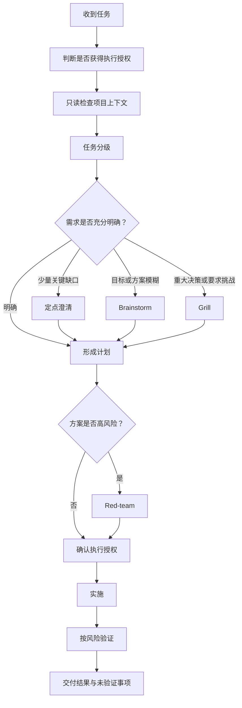

# Reliable Task Execution 使用说明

`reliable-task-execution` 用于提高复杂任务和变更任务的可靠性。它会根据任务风险选择最小充分流程，在必要时澄清需求、形成设计、挑战关键假设、确认执行授权，并在实施后验证结果。

它不会要求每个任务都经历完整仪式。需求已经明确、影响局部且风险较低时，Skill 应直接完成已授权的工作。

## 目录

- [一、快速开始](#一快速开始)
- [二、完整工作流程](#二完整工作流程)
- [三、任务分级](#三任务分级)
- [四、需求深化模式](#四需求深化模式)
- [五、方案审查与实施](#五方案审查与实施)
- [六、决策快照](#六决策快照)
- [七、常见用法](#七常见用法)
- [八、常见误用](#八常见误用)

## 一、快速开始

在提示词中明确调用 Skill，并说明你希望它完成什么：

```text
Use $reliable-task-execution to implement this change and verify the result.
```

如果只有一个粗略想法，可以要求先形成设计：

```text
Use $reliable-task-execution to brainstorm this feature idea and turn it into an actionable design.
```

如果已经有方案，可以要求深入质询：

```text
Use $reliable-task-execution to grill this architecture proposal and expose weak assumptions.
```

如果希望审查一份已经形成的计划：

```text
Use $reliable-task-execution to red-team this plan and recommend whether to execute, test first, revise, or restart.
```

## 二、完整工作流程



流程中的分支按需选择。默认不连续执行“定点澄清 → Brainstorm → Grill → Red-team”。

## 三、任务分级

| 类型 | 典型信号 | 默认处理 |
| --- | --- | --- |
| Quick | 目标明确、影响局部、风险低、结果稳定 | 已授权时直接执行并做聚焦验证 |
| Moderate | 包含若干步骤，或存在有限不确定性 | 给出简短计划，解决关键缺口后继续 |
| Deep | 跨模块、成本高、影响广或包含重要决策 | 先明确范围、风险、取舍和验收标准 |
| Experimental | 无法只靠推理确定结果 | 设计最小实验并定义成功标准 |

任务分级决定流程深度，不代表必须向用户展示复杂标签。

## 四、需求深化模式

### 1. 定点澄清

适用于整体明确、但有一至三个关键缺口的任务。

- 先从项目中查找可以安全发现的答案。
- 每次只问会改变范围、行为、架构、风险或验收标准的问题。
- 必要时给出推荐默认项及其主要影响。
- 缺口解决后立即继续，不重复确认已经明确的内容。

### 2. Brainstorm

适用于目标粗略、产品行为未定、边界模糊或存在多条合理路线的任务。

Brainstorm 会逐步完成：

1. 明确目标、受影响用户或调用方、现状与约束。
2. 每轮聚焦一个决策主题。
3. 在确有替代方案时比较两至三个方案。
4. 明确给出推荐方案和决定性取舍。
5. 补齐边界、流程、失败行为、排除范围与验收标准。
6. 汇总设计和剩余假设。

Brainstorm 的设计确认只代表方案对齐，不自动授权修改文件、代码或外部系统。

### 3. Grill

适用于用户明确要求挑战方案，或重要决策建立在薄弱假设之上的情况。

- 每轮只挑战一个最高影响的未决问题。
- 根据用户回答继续追踪新暴露的关键假设。
- 明确说明该问题会影响的接口、失败模式、成本或用户体验。
- 大约每三至五个关键问题汇总一次已解决和未解决事项。
- 当继续追问不会改变设计、用户要求停止，或用户明确接受剩余假设时结束。

Grill 不是通用问卷，也不应把偏好包装成风险。

## 五、方案审查与实施

### Red-team

Red-team 面向已经形成的方案。它重点检查：

- 最可能导致方案失败的原因；
- 未验证的假设和遗漏的失败情况；
- 过于乐观的捷径；
- 是否存在更简单的路线；
- 可以最小成本证伪风险的实验。

最终建议应是：直接执行、先实验、修改方案或重新设计之一。

### 执行授权

以下表达通常只授权读取和分析，不授权修改：

- 分析、诊断、解释或研究；
- 审查方案或代码；
- 提供建议或计划；
- 讨论一个目标或想法。

“开始做”“实现”“修改”“修复”等明确指令通常构成普通实施授权。部署、发布、推送、破坏性操作、敏感信息访问和外部系统写入仍需要针对具体动作单独确认。

### 验证

实施后从最小相关检查开始，再根据风险扩大范围，例如：

- 格式、静态分析和类型检查；
- 聚焦测试与更广泛回归测试；
- 构建检查；
- 行为或界面变化后的真实用户路径验证；
- 最终差异、意外文件和敏感信息检查。

Skill 不应声称执行过实际未运行的检查。

## 六、决策快照

需求深化完成后，复杂任务可以输出一份简短快照：

```text
已确认：目标、范围和主要行为
接受的假设：当前依赖能满足预期吞吐量
推荐方案：异步处理；用更高实现复杂度换取稳定延迟
主要风险：重试导致重复处理
尚未验证：峰值负载下的队列增长速度
下一步：执行最小负载实验；尚未获得实施授权
```

## 七、常见用法

### 实现明确的小改动

```text
Use $reliable-task-execution to update this validation rule, run the focused tests, and report the final diff.
```

预期行为：确认范围明确后直接执行，不进入完整 Brainstorm 或 Grill。

### 把粗略想法变成设计

```text
Use $reliable-task-execution to brainstorm an approval workflow for this application. Do not implement it yet.
```

预期行为：检查现状、逐步明确决策、比较方案并输出设计，不修改项目。

### 挑战高影响架构方案

```text
Use $reliable-task-execution to grill my proposal to replace the shared authentication service, then red-team the resulting plan.
```

预期行为：先解决关键决策，再审查形成后的方案；不会把两种模式混为一轮泛泛评论。

### 验证真实用户体验

```text
Use $reliable-task-execution to test the signup journey from the real entry point and report issues with evidence. Do not fix them.
```

预期行为：通过真实界面执行路径并报告问题；测试授权不等于修复授权。

## 八、常见误用

- 不要因为 Skill 被调用就强制进行长篇访谈。
- 不要询问项目文件或现有规范已经能够回答的问题。
- 不要默认串联全部深化和审查模式。
- 不要把设计确认解释为实施、提交、推送或部署授权。
- 不要用代码检查代替用户明确要求的真实端到端体验测试。
- 不要把部分进展描述为任务已经完成。

`SKILL.md` 是执行规则的权威来源；本文用于解释使用方法和预期体验。如果两者出现差异，以 `SKILL.md` 为准。
